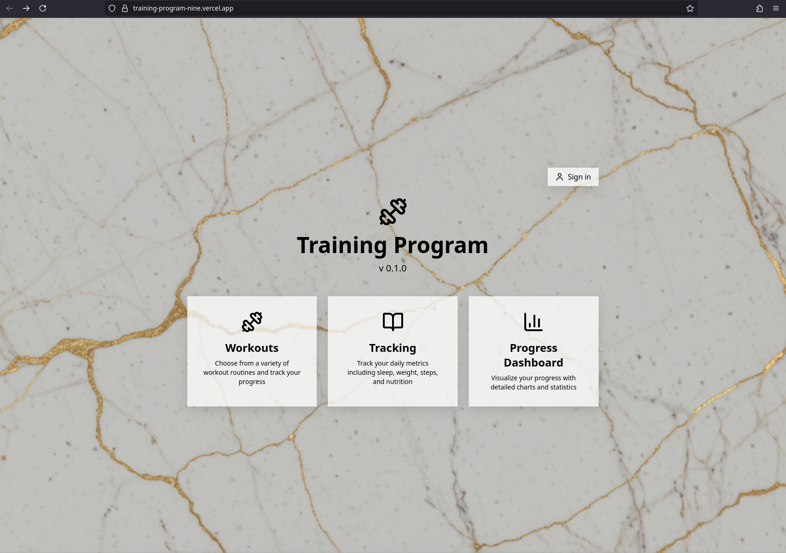

# Training Program - Science-Based Home Gym Hypertrophy Tracker

A comprehensive workout tracking application built with React, Tailwind CSS, and modern JavaScript best practices. **Optimized for HOME GYM training using Brad Schoenfeld's hypertrophy research and evidence-based principles.**



## Home Gym Equipment

This program is specifically designed for the following equipment:

| Equipment | Primary Use |
|-----------|-------------|
| **Dumbbells** (adjustable) | All pressing, rowing, curling, extensions, lunges, RDLs |
| **Ironmaster Bench** | Flat, incline, decline pressing and support |
| ↳ Leg Attachment | Leg extensions and leg curls |
| ↳ Preacher Attachment | Preacher curls for bicep isolation |
| ↳ Pull-up Attachment | Pull-ups, chin-ups, hanging leg raises |
| **Gymnastic Rings** | Dips, rows, push-ups, flyes, face pulls |
| **Resistance Bands** | Face pulls, lateral raises, accommodating resistance |
| **Bullworker** | Isometric chest/arm work |
| **Power Twisters** | Chest compression, isometric training |
| **Hand Gripper** | Crush grip strength |
| **Lattice Lifting Pin** | Finger/grip strength |
| **Wooden Minibar** | Wrist work, small exercises |

## Science-Based Programming

This program is built on the latest research in muscle hypertrophy, including:

- **Brad Schoenfeld's Volume Research** - Optimal 10-20 sets per muscle group per week
- **Frequency Studies** - 2x/week training for each muscle group
- **Rep Range Science** - Strategic use of 6-20 rep ranges for different adaptations
- **Stretch-Mediated Hypertrophy** - Exercises emphasizing lengthened positions (2023 research)
- **Progressive Overload Principles** - Multiple progression methods
- **Periodization Models** - 12-week training blocks for continuous progress

## Program Overview

### 6-Day Push/Pull/Legs Split
- **Workout A**: Push (Chest/Shoulders/Triceps) - Heavy Focus
- **Workout B**: Pull (Back/Biceps/Rear Delts) - Volume Focus
- **Workout C**: Legs (Quads/Hamstrings/Glutes) - Compound Focus
- **Workout D**: Push Variation - Hypertrophy Focus
- **Workout E**: Pull Variation - Metabolic Focus
- **Workout F**: Legs Variation - Unilateral Focus

### Key Features
- **Home gym optimized** - Every exercise uses available equipment
- **Ring training integration** - Superior muscle activation for push movements
- **Evidence-based exercise selection** - Based on EMG and hypertrophy research
- **Optimal volume distribution** - 10-17 sets/muscle/week
- **Strategic rep ranges** - 6-20 reps based on exercise type
- **Progressive overload tracking** - Built-in progression methods
- **Exercise notes** - Form cues and scientific rationale for each movement

## Training Principles

### Volume Guidelines (Based on Schoenfeld et al. 2017)
| Muscle Group | Sets/Week | Status |
|--------------|-----------|--------|
| Chest | 16 | Optimal |
| Back | 17 | Optimal |
| Shoulders | 14 | Optimal |
| Biceps | 14 | Optimal |
| Triceps | 11 | Optimal |
| Quads | 16 | Optimal |
| Hamstrings | 15 | Optimal |
| Glutes | 16 | Optimal |
| Calves | 8 | Consider adding |

### Rep Range Strategy
- **Heavy (6-8 reps)**: DB Bench, DB OHP, Pull-ups - strength/myofibrillar hypertrophy
- **Moderate (8-12 reps)**: Most accessory work - sarcoplasmic hypertrophy
- **High (12-20 reps)**: Lateral raises, face pulls, calves - metabolic stress

### Progression Methods
1. **Load Progression**: Increase weight (2.5-5lbs) when hitting rep targets
2. **Rep Progression**: Add reps when load progression stalls
3. **Ring Progression**: Progress to harder ring variations
4. **Band Progression**: Use thicker bands or combine bands

## Home Gym Advantages

Your equipment provides ADVANTAGES over commercial gyms:

| Home Gym Exercise | vs. Commercial Gym | Advantage |
|-------------------|-------------------|-----------|
| DB Bench Press | Barbell Bench | Greater ROM, better pec stretch |
| Pull-ups | Lat Pulldown | Higher EMG activation |
| Ring Dips | Machine Dips | 15-20% more muscle activation |
| Ring Flyes | Cable/Machine Flyes | Superior stretch-mediated hypertrophy |
| Bulgarian Split Squat | Leg Press | Better unilateral development |

## Installation

First, clone the repository:

```bash
git clone https://github.com/nstapc/training-program.git
cd training-program
```

Then install dependencies:

```bash
npm install
```

## Running the Application

### Development Mode
```bash
npm run dev
```
This will start the Vite development server at `http://localhost:5173`

### Production Build
```bash
npm run build
npm run preview
```

## Testing

Run the comprehensive test suite:
```bash
npm test
```

## Science References

### Key Research Papers
- **Schoenfeld et al. (2017)** - "Dose-response relationship between weekly resistance training volume and increases in muscle mass"
- **Schoenfeld et al. (2014)** - "Muscular adaptations in low- vs. high-load resistance training"
- **Schoenfeld et al. (2016)** - "Resistance training frequency effects on muscular strength"
- **Maeo et al. (2023)** - Stretch-mediated hypertrophy research

### Programming Principles
- **2x/week frequency** for optimal muscle protein synthesis
- **Progressive overload** through systematic load/volume increases
- **Exercise variation** to prevent plateaus and target different muscle fibers
- **Periodized training** with accumulation, intensification, and peak phases
- **Stretch-mediated hypertrophy** - emphasis on lengthened position exercises

## Workout Data Structure

Each workout follows this evidence-based structure:
```javascript
{
  name: 'Workout Name',
  description: 'Workout focus description',
  exercises: [
    {
      name: 'Exercise Name',
      sets: 3-4,
      reps: 'rep-range',
      rest: 60-150,
      group: 'A1',  // Superset support
      notes: 'Form cues and scientific rationale',
      equipment: 'Required equipment'
    }
  ]
}
```

## Periodization Model (12-Week Cycle)

| Phase | Weeks | Focus | Intensity |
|-------|-------|-------|-----------|
| Accumulation | 1-4 | Volume, technique | 65-75% (2-3 RIR) |
| Intensification | 5-8 | Strength, overload | 75-85% (1-2 RIR) |
| Peak | 9-11 | Maximum intensity | 85-95% (0-1 RIR) |
| Deload | 12 | Recovery | 50-60% effort |

## Implementation Guide

1. **Week 1**: Start with conservative weights, master ring movements
2. **Track progress**: Use the built-in workout tracker for all exercises
3. **Follow progression**: Increase load when hitting target reps
4. **Deload every 4th week**: 50% volume at 60% intensity
5. **Adjust volume**: Based on individual recovery capacity

For detailed programming guidance, see:
- `src/data/workouts.js` - All exercises with notes and equipment
- `src/data/progressionGuide.js` - Evidence-based progression strategies
- `SCIENCE_ANALYSIS.md` - Complete scientific rationale

## Equipment-Specific Tips

### Gymnastic Rings
- Start with feet forward (easier) and progress to full extension
- Turn rings out (RTO) at top of dips/push-ups for extra stimulus
- Adjust height for rows to control difficulty

### Resistance Bands
- Use for face pulls and lateral raises (constant tension)
- Add to DB movements for accommodating resistance
- Great for warm-ups and activation work

### Preacher Attachment
- Eliminates momentum on curls
- Excellent for short head biceps emphasis
- Use full ROM - stretch at bottom is key

### Leg Attachment
- Slow eccentrics (3-4 sec) on leg curls
- Pause at contraction on leg extensions
- Superset extensions/curls for efficiency
