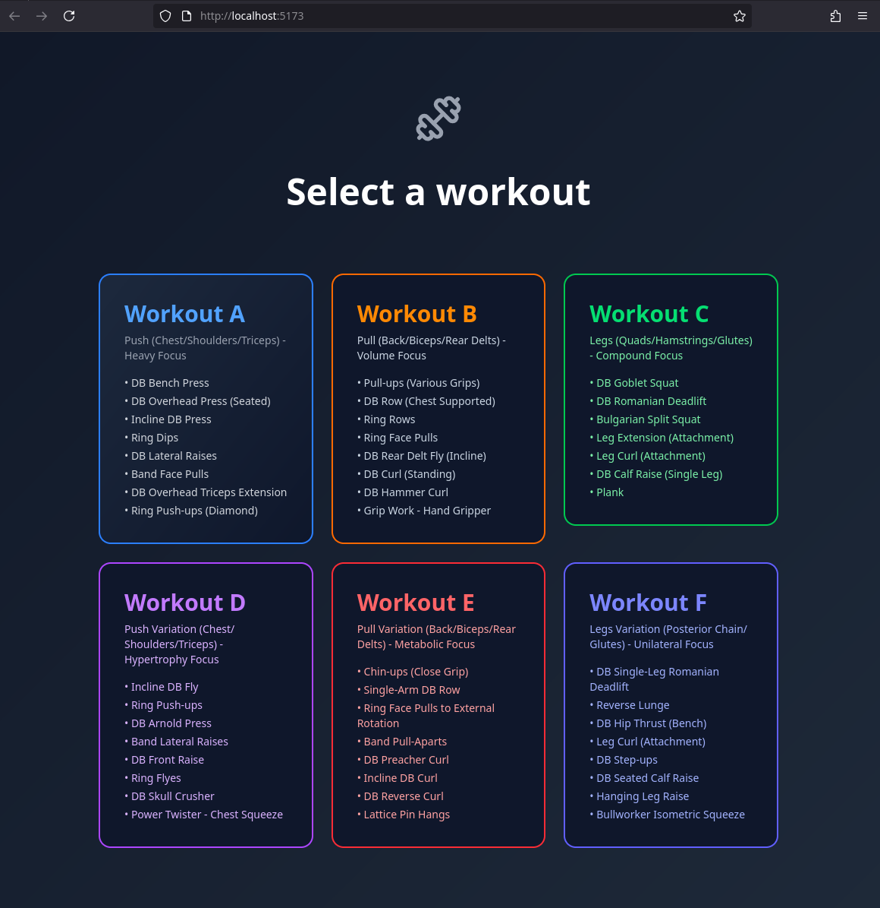

# Training Program - Workout Tracker

A comprehensive workout tracking application built with React, Tailwind CSS, and modern JavaScript best practices.




## Installation

First, clone the repository:

```bash
git clone https://github.com/nstapc/training-program.git
cd training-program
```

Then install dependencies:

```bash
npm install
```

## Running the Application

### Development Mode
```bash
npm run dev
```
This will start the Vite development server at `http://localhost:5173`

### Production Build
```bash
npm run build
npm run preview
```

## Testing

Run the comprehensive test suite:
```bash
npm test
```

## Workout Data Structure

Each workout follows this structure:
```javascript
{
  name: 'Workout Name',
  color: 'theme-color', // blue, orange, green, purple, red, indigo
  description: 'Workout focus description',
  exercises: [
    {
      name: 'Exercise Name',
      sets: 3-4, // Number of sets
      reps: 'rep-range', // e.g., '8-10'
      rest: 30-180, // Rest time in seconds
      group: 'A1' // Exercise group (superset support)
    }
  ]
}
```