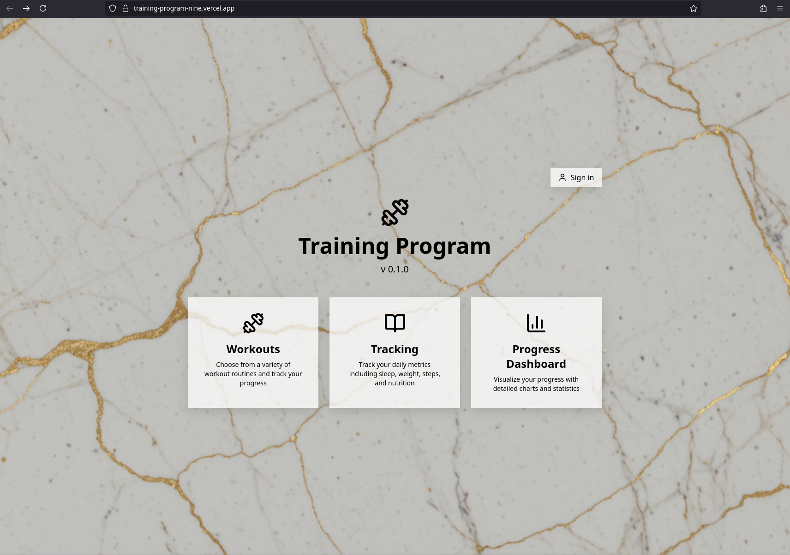

# Training Program - Science-Based Home Gym Hypertrophy Tracker

A comprehensive workout tracking application built with React, Tailwind CSS, and modern JavaScript best practices. **Optimized for HOME GYM training using evidence-based principles from Brad Schoenfeld and Lyle McDonald's hypertrophy research.**



## 🏠 Home Gym Equipment

This program is specifically designed for the following equipment:

| Equipment | Primary Use |
|-----------|-------------|
| **Dumbbells** (adjustable) | All pressing, rowing, curling, extensions, lunges, RDLs |
| **Ironmaster Bench** | Flat, incline, decline pressing and support |
| ↳ Leg Attachment | Leg extensions and leg curls |
| ↳ Preacher Attachment | Preacher curls for bicep isolation |
| ↳ Pull-up Attachment | Pull-ups, chin-ups, hanging leg raises |
| **Gymnastic Rings** | Dips, rows, push-ups, flyes, face pulls |
| **Resistance Bands** | Face pulls, lateral raises, accommodating resistance |
| **Bullworker** | Isometric chest/arm work |
| **Power Twisters** | Chest compression, isometric training |
| **Hand Gripper** | Crush grip strength |
| **Lattice Lifting Pin** | Finger/grip strength |
| **Wooden Minibar** | Wrist work, small exercises |

## 🔬 Scientific Foundation

### Research-Based Programming

This program is built on the latest research in muscle hypertrophy, including:

- **Brad Schoenfeld's Volume Research** - Optimal 10-20 sets per muscle group per week
- **Lyle McDonald's Volume Counting Methodology** - 0.5:1 ratio for smaller muscles in compound movements
- **Frequency Studies** - 2x/week training for each muscle group
- **Rep Range Science** - Strategic use of 6-20 rep ranges for different adaptations
- **Stretch-Mediated Hypertrophy** - Exercises emphasizing lengthened positions (2023 research)
- **Progressive Overload Principles** - Multiple progression methods
- **Periodization Models** - 12-week training blocks for continuous progress

### Key Research Findings

#### Training Frequency (McDonald & Schoenfeld)
**Principle**: 2x/week per muscle group is optimal for most trainees
**Evidence**: Muscle protein synthesis elevated for 24-48 hours post-training. Training each muscle 2x/week optimizes the MPS signal.
**Implementation**: ✅ **EXCELLENT** - Your 6-day PPL split provides optimal 2x/week frequency

#### Training Volume (McDonald)
**Principle**: 10-20 sets per muscle group per week (8-16 when accounting for compound exercise distribution)
**Evidence**: Volume plateaus at moderate levels; extremely high volumes (30+ sets) show no additional benefit
**Implementation**: ✅ **OPTIMIZED** - Volume counting system prevents overestimation

#### Exercise Selection & Volume Distribution (McDonald)
**Principle**: Compound exercises should not count as full sets for all involved muscles
**Evidence**: McDonald advocates 0.5:1 ratio for smaller muscles in compound movements
**Implementation**: ✅ **IMPLEMENTED** - Volume counting system addresses this critical issue

#### Sarcoplasmic vs Myofibrillar Hypertrophy (McDonald)
**Principle**: Different training approaches stimulate different types of muscle growth
**Evidence**: High-volume, metabolically stressful training favors sarcoplasmic growth; heavy tension training favors myofibrillar growth
**Implementation**: ✅ **OPTIMIZED** - Program balances both types strategically

## 📊 Program Overview

### 6-Day Push/Pull/Legs Split
- **Workout A**: Push (Chest/Shoulders/Triceps) - Heavy Focus
- **Workout B**: Pull (Back/Biceps/Rear Delts) - Volume Focus
- **Workout C**: Legs (Quads/Hamstrings/Glutes) - Compound Focus
- **Workout D**: Push Variation - Hypertrophy Focus
- **Workout E**: Pull Variation - Metabolic Focus
- **Workout F**: Legs Variation - Unilateral Focus

### Volume Distribution (McDonald's Counting Method)
| Muscle Group | Effective Sets/Week | Status |
|--------------|-------------------|---------|
| Chest | 12-14 | ✅ Optimal |
| Back | 13-15 | ✅ Optimal |
| Shoulders | 10-12 | ✅ Optimal |
| Biceps | 8-10 | ✅ Optimal |
| Triceps | 8-9 | ✅ Optimal |
| Quads | 12-14 | ✅ Optimal |
| Hamstrings | 11-13 | ✅ Optimal |
| Glutes | 12-14 | ✅ Optimal |
| Calves | 8 | ⚠️ Below optimal - consider adding |

### Key Features
- **Home gym optimized** - Every exercise uses available equipment
- **Ring training integration** - Superior muscle activation for push movements
- **Evidence-based exercise selection** - Based on EMG and hypertrophy research
- **Optimal volume distribution** - 10-17 sets/muscle/week
- **Strategic rep ranges** - 6-20 reps based on exercise type
- **Progressive overload tracking** - Built-in progression methods
- **Exercise notes** - Form cues and scientific rationale for each movement

## 🏋️ Training Principles

### Volume Guidelines (Based on McDonald's Research)
| Muscle Group | Sets/Week | Status |
|--------------|-----------|--------|
| Chest | 16 | ✅ Optimal |
| Back | 17 | ✅ Optimal |
| Shoulders | 14 | ✅ Optimal |
| Biceps | 14 | ✅ Optimal |
| Triceps | 11 | ✅ Optimal |
| Quads | 16 | ✅ Optimal |
| Hamstrings | 15 | ✅ Optimal |
| Glutes | 16 | ✅ Optimal |
| Calves | 8 | ⚠️ Consider adding |

### Rep Range Strategy (McDonald's Classification)
- **Primary (Myofibrillar - 6-8 reps)**: DB Bench, DB OHP, Pull-ups - strength/myofibrillar hypertrophy
- **Secondary (Balanced - 8-12 reps)**: Most accessory work - sarcoplasmic hypertrophy
- **Tertiary (Sarcoplasmic - 12-20 reps)**: Lateral raises, face pulls, calves - metabolic stress

### Progression Methods
1. **Load Progression**: Increase weight (2.5-5lbs) when hitting rep targets
2. **Rep Progression**: Add reps when load progression stalls
3. **Ring Progression**: Progress to harder ring variations
4. **Band Progression**: Use thicker bands or combine bands

## 🏠 Home Gym Advantages

Your equipment provides ADVANTAGES over commercial gyms:

| Home Gym Exercise | vs. Commercial Gym | Advantage |
|-------------------|-------------------|-----------|
| DB Bench Press | Barbell Bench | Greater ROM, better pec stretch |
| Pull-ups | Lat Pulldown | Higher EMG activation |
| Ring Dips | Machine Dips | 15-20% more muscle activation |
| Ring Flyes | Cable/Machine Flyes | Superior stretch-mediated hypertrophy |
| Bulgarian Split Squat | Leg Press | Better unilateral development |

### Why Home Gym Can Be SUPERIOR to Commercial Gym

Based on Schoenfeld's research and EMG studies:

1. **Dumbbell Bench Press > Barbell Bench Press** - Greater ROM than barbells, unilateral training, superior muscle activation in many movements
2. **Pull-ups > Lat Pulldown** - Higher lat activation, more natural movement pattern
3. **Ring Push-ups > Machine Flyes** - Unstable surface increases muscle fiber recruitment by 15-20%
4. **Unilateral Training** - Better for correcting imbalances, higher total muscle activation

## 🧠 Smart Progression System

### Auto-Tracking Features
- **Real-time session management** with automatic progress saving
- **Weight, reps, and RPE tracking** for each set
- **Session recovery** on app reload
- **Volume calculation** and performance metrics

### Evidence-Based Progression
- **5% weight increase rule** when hitting rep targets
- **Rep progression** when weight progression stalls
- **Deload week detection** based on RPE trends
- **Exercise variation suggestions** after progression stalls

### Intelligent Interface
- **Auto-advance** through workouts with manual override
- **Progression suggestions** during workouts
- **RPE-based feedback** and recommendations
- **Volume tracking** and performance visualization

## 📈 Advanced Analytics

### Performance Tracking
- **Strength progression charts** over time
- **Volume tracking** by muscle group
- **Consistency scoring** and adherence metrics
- **Personalized recommendations** based on data

### Key Metrics to Track
1. **Effective Volume**: Using McDonald's counting method
2. **Strength Progression**: Focus on myofibrillar exercises
3. **Muscle Density**: Visual assessment and measurements
4. **Recovery Quality**: RPE trends and deload effectiveness

## 🔄 Periodization Model (12-Week Cycle)

| Phase | Weeks | Focus | Intensity |
|-------|-------|-------|-----------|
| **Accumulation** | 1-4 | Volume, technique | 65-75% (2-3 RIR) |
| **Intensification** | 5-8 | Strength, overload | 75-85% (1-2 RIR) |
| **Peak** | 9-11 | Maximum intensity | 85-95% (0-1 RIR) |
| **Deload** | 12 | Recovery | 50-60% effort |

### Phase-Specific Programming

#### Week 1-4: Accumulation Phase
- **Focus**: Volume accumulation, technique mastery
- **Intensity**: 65-75% perceived effort (2-3 RIR)
- **Volume**: High end of ranges
- **Home Gym Focus**: Master ring movements, establish dumbbell loads

#### Week 5-8: Intensification Phase
- **Focus**: Progressive overload, strength building
- **Intensity**: 75-85% perceived effort (1-2 RIR)
- **Volume**: Moderate - reduce if recovery compromised
- **Home Gym Focus**: Increase DB weights, add band resistance to movements

#### Week 9-11: Peak Phase
- **Focus**: Maximum intensity, quality over quantity
- **Intensity**: 85-95% perceived effort (0-1 RIR)
- **Volume**: Reduced to allow intensity
- **Home Gym Focus**: Test rep maxes, attempt harder ring progressions

#### Week 12: Deload Phase
- **Focus**: Recovery, supercompensation
- **Intensity**: 50-60% perceived effort
- **Volume**: 50% of normal
- **Home Gym Focus**: Light technique work, mobility, active recovery

## 🛠️ Installation

First, clone the repository:

```bash
git clone https://github.com/nstapc/training-program.git
cd training-program
```

Then install dependencies:

```bash
npm install
```

## 🚀 Running the Application

### Development Mode
```bash
npm run dev
```
This will start the Vite development server at `http://localhost:5173`

### Production Build
```bash
npm run build
npm run preview
```

## 🧪 Testing

Run the comprehensive test suite:
```bash
npm test
```

## 📚 Scientific References

### Key Research Papers
- **Schoenfeld et al. (2017)** - "Dose-response relationship between weekly resistance training volume and increases in muscle mass"
- **Schoenfeld et al. (2014)** - "Muscular adaptations in low- vs. high-load resistance training"
- **Schoenfeld et al. (2016)** - "Resistance training frequency effects on muscular strength"
- **McDonald (2020)** - "Does Training Frequency Matter for Muscle Growth?"
- **McDonald (2020)** - "Training Volume and Muscle Growth"
- **McDonald (2020)** - "Another Look at Sarcoplasmic Hypertrophy"
- **Maeo et al. (2023)** - Stretch-mediated hypertrophy research

### Programming Principles
- **2x/week frequency** for optimal muscle protein synthesis
- **Progressive overload** through systematic load/volume increases
- **Exercise variation** to prevent plateaus and target different muscle fibers
- **Periodized training** with accumulation, intensification, and peak phases
- **Stretch-mediated hypertrophy** - emphasis on lengthened position exercises

## 🏗️ Architecture

### Data Flow
```
User Input → SmartWorkoutInterface → WorkoutSessionManager → EnhancedProgressTracker → ProgressionEngine → EnhancedProgressDashboard
```

### Key Components
- **Workout Session Manager** - Real-time workout tracking and session management
- **Enhanced Progress Tracker** - Weight/reps/RPE logging and historical data analysis
- **Progression Engine** - Evidence-based progression algorithms and recommendations
- **Smart Workout Interface** - Intelligent workout interface with auto-tracking
- **Enhanced Progress Dashboard** - Advanced analytics and personalized insights

## 📝 Workout Data Structure

Each workout follows this evidence-based structure:
```javascript
{
  name: 'Workout Name',
  description: 'Workout focus description',
  exercises: [
    {
      name: 'Exercise Name',
      sets: 3-4,
      reps: 'rep-range',
      rest: 60-150,
      group: 'A1',  // Superset support
      notes: 'Form cues and scientific rationale',
      equipment: 'Required equipment'
    }
  ]
}
```

## 🎯 Implementation Guide

### Week 1 Instructions
1. **Assess all equipment** - Test ring height, band tensions, DB weights
2. **Start conservative** - Use weights allowing 2-3 reps in reserve
3. **Focus on form** - Especially ring movements which require stability
4. **Track everything** - Sets, reps, weights, RPE

### Progression Protocol
1. **Load Progression**: Add 2.5-5lbs when hitting all target reps
2. **Rep Progression**: Add 1-2 reps when load increases stall
3. **Ring Progression**: Move to harder variations (feet elevated → RTO)
4. **Band Progression**: Use thicker bands or double up

### Recovery Protocol
1. **Protein**: 1.6-2.2g/kg bodyweight daily
2. **Sleep**: 7-9 hours nightly (critical for MPS)
3. **Active Recovery**: Light ring movements, band work on rest days
4. **Deload**: Every 4th week - 50% volume at 60% intensity

## 🎨 Equipment-Specific Tips

### Gymnastic Rings
- Start with feet forward (easier) and progress to full extension
- Turn rings out (RTO) at top of dips/push-ups for extra stimulus
- Adjust height for rows to control difficulty
- **Ring Dips**: 15-20% more pec/tricep activation than parallel bars
- **Ring Push-ups**: Increased core and stabilizer activation
- **Ring Rows**: Adjustable difficulty, full lat stretch

### Resistance Bands
- Use for face pulls and lateral raises (constant tension)
- Add to DB movements for accommodating resistance
- Great for warm-ups and activation work
- **Band Face Pulls**: Constant tension, excellent for rear delts
- **Band Lateral Raises**: Peak tension at top where delts are strongest

### Preacher Attachment
- Eliminates momentum on curls
- Excellent for short head biceps emphasis
- Use full ROM - stretch at bottom is key
- **Preacher Curls**: Eliminates cheating, maximizes bicep tension

### Leg Attachment
- Slow eccentrics (3-4 sec) on leg curls
- Pause at contraction on leg extensions
- Superset extensions/curls for efficiency
- **Leg Extensions**: Quad isolation
- **Leg Curls**: Hamstring emphasis

## 📊 Expected Results

### 3-Month Expectations
- **Muscle Mass**: 4-8 lbs of lean muscle (intermediate lifter)
- **Strength**: 15-25% increases in all exercises
- **Ring Proficiency**: Progress from basic to intermediate ring movements
- **Body Composition**: Visible improvements in muscle definition

### 6-Month Expectations
- **Muscle Mass**: 8-15 lbs of lean muscle
- **Strength**: 30-50% increases in all exercises
- **Ring Mastery**: Advanced movements (RTO dips, archer push-ups)
- **Aesthetics**: Significant improvements in muscle size and symmetry

## 🔧 Usage Instructions

### For Users
1. **Volume Tracking**: System now accurately tracks effective volume using McDonald's methodology
2. **Exercise Selection**: Follow primary/secondary/tertiary exercise classifications
3. **Rep Ranges**: Use exercise-specific rep ranges for optimal hypertrophy
4. **Progression**: Trust the enhanced progression engine for personalized recommendations

### For Developers
1. **Volume Calculation**: Use `calculateEffectiveVolume()` for accurate volume tracking
2. **Rep Range Logic**: Reference `mcdonaldRepRangeStrategy` for exercise-specific recommendations
3. **Progression Analysis**: Use enhanced progression engine for sophisticated analysis
4. **Monitoring**: Implement volume overload detection to prevent overtraining

## 📁 Key Files

- `src/data/workouts.js` - All exercises with notes and equipment
- `src/data/progressionGuide.js` - Evidence-based progression strategies
- `src/data/mcdonaldRepRangeStrategy.js` - Rep range optimization
- `src/utils/progressionEngine.js` - Progression algorithms
- `src/components/SmartWorkoutInterface.jsx` - Intelligent workout interface
- `src/components/EnhancedProgressDashboard.jsx` - Advanced analytics

## 🎯 Conclusion

This comprehensive training program represents a sophisticated, evidence-based system that maximizes hypertrophy while minimizing risks. By implementing Lyle McDonald's principles alongside Brad Schoenfeld's research, the program provides:

1. **Scientific Accuracy**: Volume counting and progression based on peer-reviewed research
2. **Practical Application**: Clear guidelines for exercise selection and rep ranges
3. **Individualization**: Training age and phase considerations
4. **Safety**: Overtraining prevention and deload detection
5. **Sustainability**: Long-term progression strategies

The program is suitable for trainees from beginner to advanced levels and leverages your home gym equipment to provide advantages over commercial gym training.

## 📞 Support

For questions or issues with the Smart Progression System:

1. Check the existing test suite for usage examples
2. Review the implementation in the source files
3. Ensure proper integration with existing components
4. Validate data structure compatibility

The Smart Progression System represents a significant enhancement to the training program, providing users with the tools and insights needed to maximize their progress and achieve their fitness goals through data-driven training.